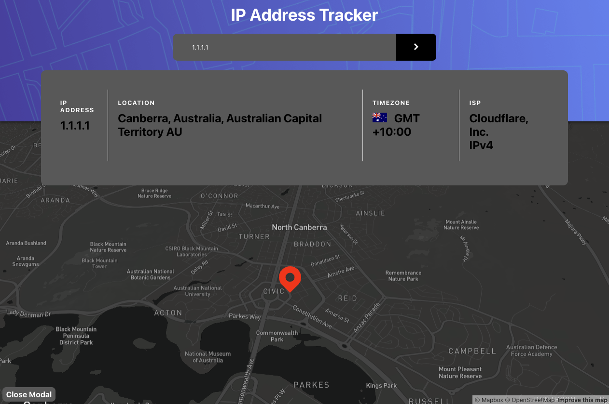

# Frontend Mentor - IP address tracker solution

This is a solution to the [IP address tracker challenge on Frontend Mentor](https://www.frontendmentor.io/challenges/ip-address-tracker-I8-0yYAH0). Frontend Mentor challenges help you improve your coding skills by building realistic projects. 

Note: best browser to test/use the site is Google Chrome && to use the map services you have to allow location services on your browser

## Table of contents

- [Overview](#overview)
  - [The challenge](#the-challenge)
  - [Screenshot](#screenshot)
  - [Links](#links)
- [My process](#my-process)
  - [Built with](#built-with)
  - [What I learned](#what-i-learned)
  - [Continued development](#continued-development)
  - [Useful resources](#useful-resources)
- [Author](#author)


## Overview

### The challenge

Users should be able to:

- View the optimal layout for each page depending on their device's screen size
- See hover states for all interactive elements on the page
- See their own IP address on the map on the initial page load
- Search for any IP addresses or domains and see the key information and location
- Be able to change there systems appearance to alter the theme in the application

### Screenshot

Note: in the screenshots I changed my system appearance to change/alter the theme of the site from a light mode to a dark mode, You can go on the website and give it a try!




### Links

- Solution URL: [IP Address Tracker](https://ip-tracker-marcelckp.netlify.app/);
- Live Site URL: [IP Address Tracker](https://ip-tracker-marcelckp.netlify.app/);

## My process

### Built with

- Semantic HTML5 markup
- CSS custom properties
- Flexbox
- CSS Grid
- Mobile-first workflow
- [React](https://reactjs.org/) - JS library
- [React-map-gl] - MapBox 

Note: best browser to test/use the site is Google Chrome

### What I learned

I learned how to use React Map GL to create interactive maps and render them in react, I also learned how to use the navigator built in geolocation func in js to access a users current location & I used the longitude and latitude values I received from there (navigator.geolocation) to create a map with map-gl 

I'm very proud of the code below because I created a async function within a synchronous useEffect call to get all the information I needed and set values in my useState hooks on page load to store and display the current users information on the initial load of the page and additional searches of IP addresses will change/ alter all the information displayed,

below is how I found my solution.

```js
  useEffect( () => {
    async function data() {
      const ip = await axios.get('https://api.ipify.org/?format=json')
        .then((res) => {
          return res.data.ip;
        })

      await axios.get(`https://ipwhois.app/json/${ip}`)
        .then((res) => {
          // console.log(res.data)
          setCurrentUsersData(res.data)
        })
      
      if (navigator.geolocation) {
        navigator.geolocation.getCurrentPosition((position) => {
          setCurrentUserLocation(position.coords);
          // console.log(position)
          setViewport({
            latitude: position.coords.latitude,
            longitude: position.coords.longitude,
            zoom: 13,
            pitch: 50
          })
        }, (error) => {
          switch(error.code) {
            case error.PERMISSION_DENIED:
              alert('User Denied the request for Geolocation.');
              break;
            case error.POSITION_UNAVAILABLE:
              alert('Location information is unavailable.');
              break;
            case error.TIMEOUT:
              alert('The request to get user location has timed out');
              break;
            case error.UNKNOWN_ERROR:
              alert('An unknown error has occurred');
              break;
            default:
              alert('An unknown error has occurred');
          }
          console.log(error);
        })
      } else {
        alert('This Browser does no support GeoLocation')
      }
    }

      const userPrefersDark = window.matchMedia && window.matchMedia('(prefers-color-scheme: dark)').matches;

      setDarkMap(userPrefersDark)

    return data()
    },[])
```

### Continued development

For furthering the development of this project I'd add multiple routes to turn it into a multipurpose tracker app to maybe track a persons movements or the internet information/history or anything maybe even add a network tester for the network the user is on or of the ip he searches, could also add a security check section & checking the validity of vpn's if a user is on the site and activates a vpn then you can have a physical representation of your connect/IP address changing to show that it is working.


### Useful resources

- [MapBox Docs](https://docs.mapbox.com/mapbox-gl-js/guides/) - This helped me getting location information from their api on how to work with map box static images & tile queries

- [React-Map-GL](https://visgl.github.io/react-map-gl/) - This site for react-map-gl helped me Integrate MapBox into my project

## Author

- Website - [Marcel Palmer](https://calculatorapp-marcel.netlify.app)
- Frontend Mentor - [@Marcelckp](https://www.frontendmentor.io/profile/Marcelckp)
- Twitter - [@marcelckpalmer](https://www.twitter.com/marcelckpalmer)